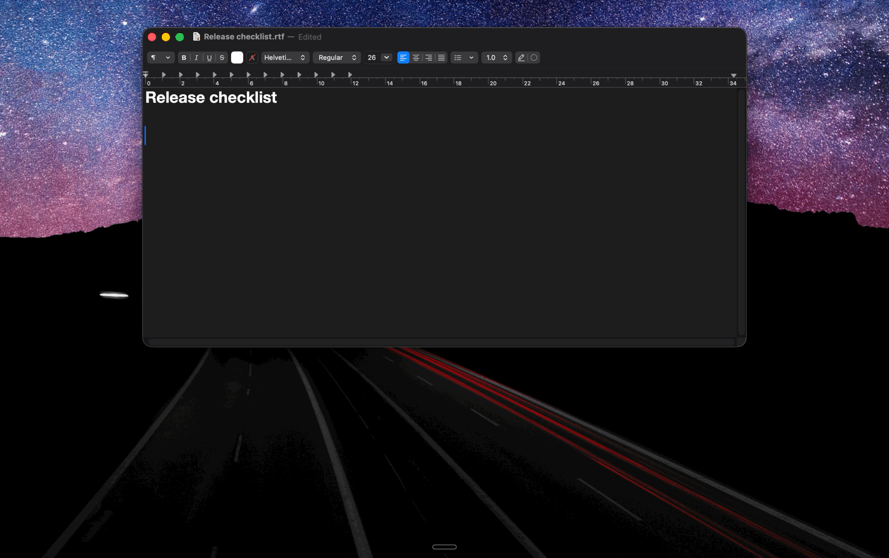
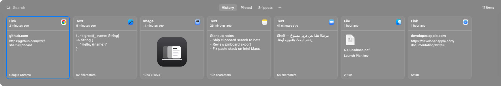
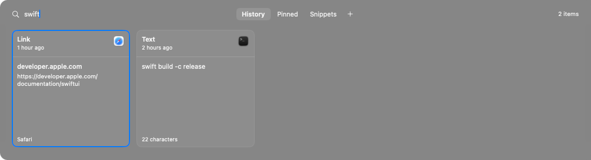
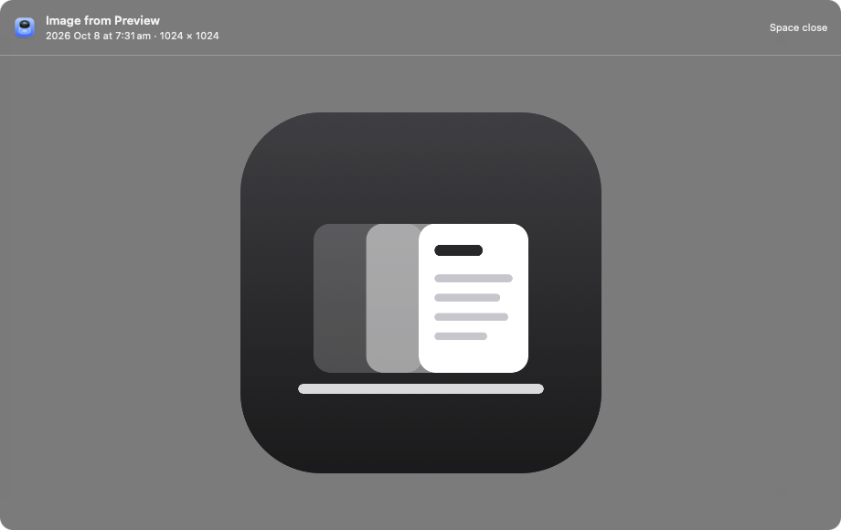
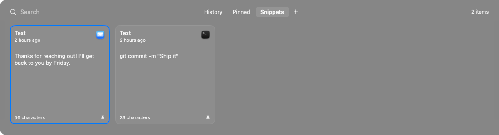

# Shelf — local clipboard history

A small native macOS clipboard manager (Swift/SwiftUI, no dependencies) that replaces Paste.
History never leaves the Mac: no iCloud, no account, no network code.





| Search everything you copied | Full preview (Space) | Pinboards |
|---|---|---|
|  |  |  |

- [User guide](docs/USER_GUIDE.md): every feature and shortcut
- [Install guide](docs/INSTALL.md): for other people, including updating and uninstalling
- [Maintainer handover](docs/HANDOVER.md): architecture, data, build, signing, releasing

## Install

**Download a release (recommended):** grab the latest `Shelf-<version>.zip` from the
[Releases page](https://github.com/lltrx/shelf-clipboard/releases), then follow the
[Install guide](docs/INSTALL.md). Shelf is signed with an Apple Developer ID and notarized by Apple,
so it opens like any other downloaded app.

**Or build from source:**

```sh
./build.sh --install   # builds, signs, installs to ~/Applications/Shelf.app and launches
```

## Maintainer / development

```sh
./build.sh --install          # build + install locally
./build.sh --package          # zip for sharing: dist/Shelf-<version>.zip (+ INSTALL/USER_GUIDE)
scripts/release.sh            # package and publish a GitHub release (maintainer only)
swift scripts/make_icon.swift # only if you change the icon
```

build.sh signs with the maintainer's Developer ID when it's in the keychain (releases are also
notarized), otherwise with a local **Shelf Local Signing** identity, otherwise ad-hoc. See
[docs/HANDOVER.md](docs/HANDOVER.md#code-signing).
Contributions are welcome — see [CONTRIBUTING.md](CONTRIBUTING.md).

## Keys (while the shelf is open)

| Key | Action |
|---|---|
| ⇧⌘V | Open / close the shelf |
| type | Search: text, links, file names, source app, and text inside screenshots |
| ← → (⌘← ⌘→) | Move selection (jump to ends) |
| Return / double-click | Paste with original formatting |
| ⇧Return | Paste as plain text |
| ⌘1 … ⌘9 (⇧ for plain) | Paste item 1–9 |
| Space | Full preview (when the search field is empty) |
| ⌘E | Edit in the preview, then ⌘Return to paste (⇧⌘Return plain) · Esc cancels |
| ⌘C | Copy to clipboard without pasting |
| ⌘P | Pin / unpin (asks which pinboard when there are several; 1–9 picks) |
| ⌘N | New pinboard |
| Tab / ⇧Tab | Next / previous tab (History, then each pinboard) |
| ⌘S | Add to / remove from the paste stack and move to the next card |
| Return (with stack) | Paste stack: pastes item 1, then each ⌘V you press pastes the next |
| ⌥Return (with stack) | Paste all stacked items at once, one per line |
| ⌘⌫ | Delete item |
| Esc | Close preview, then the shelf |

Right-click a card for the same actions; right-click a pinboard tab to rename or delete it
(deleting a pinboard moves its items back to History). A running paste stack shows `n/total` in the
menu bar, with Skip and End there; copying something new ends it.

Change the shortcut, then restart Shelf:

```sh
defaults write com.turkifaisal.shelf hotkey "cmd+option+v"
```

## Data

- `~/Library/Application Support/Shelf/history.sqlite` (mode 600) and `images/` (PNG files), folder mode 700.
- Deliberately outside this KB so the auto-commit job never picks up clipboard contents.
- Unpinned items are deleted after 30 days; pinned items never expire.
- Text keeps RTF / HTML / RTFD formatting (up to 10 MB each). Edited text is saved as a new item.
- Screenshot text is recognized on-device with Apple Vision (English and Arabic) in the background.
- Everything is captured, including passwords. Use **Pause Capture** or **Clear Unpinned History…** from the menu bar.

## Backups

- Pinboards are backed up automatically once a day to `~/Library/Application Support/Shelf/Backups/`
  (`pinboards-YYYY-MM-DD.json`, last 7 kept, mode 600). History itself is not backed up; it expires anyway.
- **Export Pinboards…** (menu bar) writes the same single JSON file anywhere you choose; images and
  formatting are embedded. It may contain secrets, so don't put it in this KB, iCloud Drive, or Box.
- **Import Pinboards…** merges a file back in: pinboards are matched by name, nothing is overwritten.
